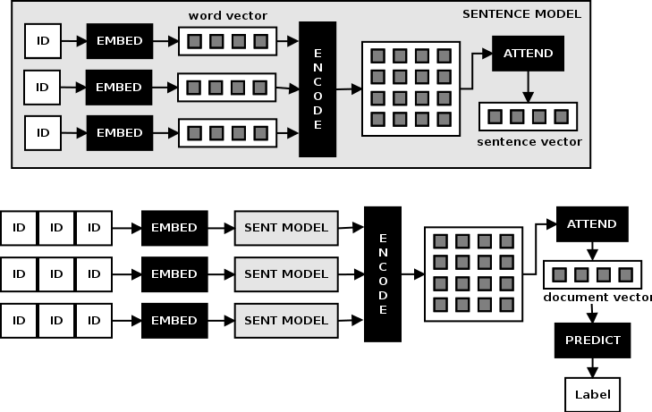
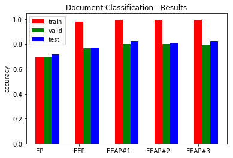
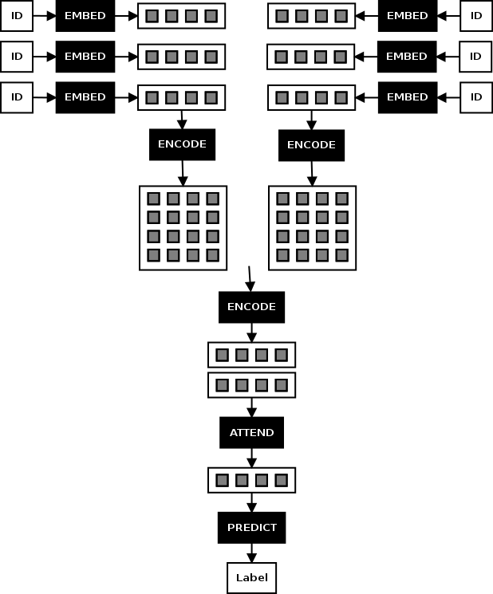
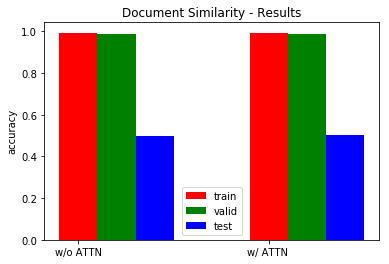
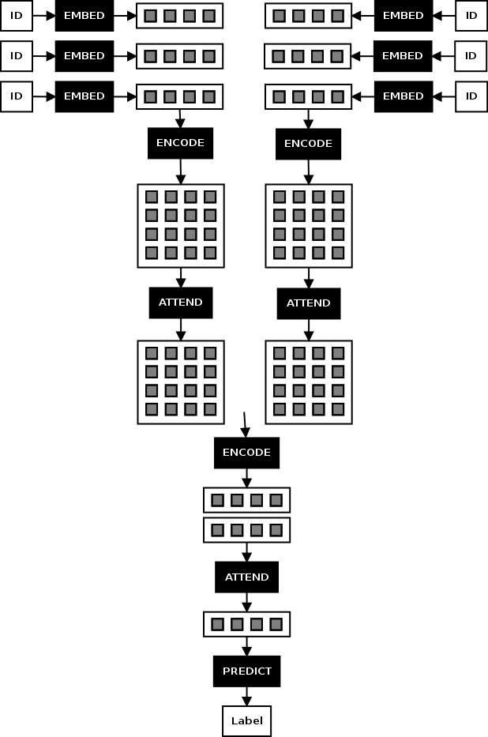
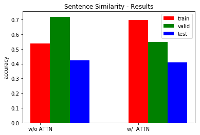

# eeap-examples

## Table of Contents

* [Introduction](#introduction)
* [Data](#data)
* [Examples](#examples)
  * [Document Classification Task](#document-classification-task)
      * [02-ng-clf-ep.ipynb](https://github.com/sujitpal/eeap-examples/blob/master/src/02-ng-clf-ep.ipynb)
      * [03-ng-clf-eep.ipynb](https://github.com/sujitpal/eeap-examples/blob/master/src/03-ng-clf-eep.ipynb)
      * [04a-ng-clf-eeap.ipynb](https://github.com/sujitpal/eeap-examples/blob/master/src/04a-ng-clf-eeap.ipynb)
      * [04b-ng-clf-eeap.ipynb](https://github.com/sujitpal/eeap-examples/blob/master/src/04b-ng-clf-eeap.ipynb)
      * [04c-ng-clf-eeap.ipynb](https://github.com/sujitpal/eeap-examples/blob/master/src/04c-ng-clf-eeap.ipynb)
  * [Document Similarity Task](#document-similarity-task)
      * [05a-ng-sim-eeap.ipynb](https://github.com/sujitpal/eeap-examples/blob/master/src/05a-ng-sim-eep.ipynb)
      * [05a-ng-sim-eeap.ipynb](https://github.com/sujitpal/eeap-examples/blob/master/src/05b-ng-sim-eeap.ipynb)
  * [Sentence Similarity Task](#sentence-similarity-task)
      * [07a-sts-sim-eep.ipynb](https://github.com/sujitpal/eeap-examples/blob/master/src/07a-sts-sim-eep.ipynb)
      * [07b-sts-sim-eeap.ipynb](https://github.com/sujitpal/eeap-examples/blob/master/src/07b-sts-sim-eeap.ipynb)
      * [07c-sts-sim-eeap.ipynb](https://github.com/sujitpal/eeap-examples/blob/master/src/07c-sts-sim-eeap.ipynb)

## Introduction

This repository contains some examples of applying the [Embed, Encode, Attend, Predict (EEAP)](https://explosion.ai/blog/deep-learning-formula-nlp) recipe proposed by Matthew Honnibal, creator of the [SpaCy](https://spacy.io/) deep learning toolkit, for building Deep Learning pipelines. 

I also gave a talk about this at [my talk at PyData Seattle 2017](https://pydata.org/seattle2017/schedule/presentation/84/).

Code is in Python. All models are built using the awesome [Keras](https://keras.io/) library. Supporting code uses [NLTK](http://www.nltk.org/) and [Scikit-Learn](http://scikit-learn.org/stable/).

The examples use 4 custom Attention layers, also available here as a Python include file. The examples themselves are written as [Jupyter notebooks](http://jupyter.org/).

## Data

Please refer to [data/README.md](data/README.md) for instructions on how to download the data necessary to run these examples.

## Examples

### Document Classification Task

The document classification task attempts to build a classification model for documents by treating it as a sequence of sentences, and sentences as sequence of words. We start with the bag of words approach, computing document embeddings as an average of its sentence embeddings, and sentence embeddings as an average of its word embeddings. Next we build a hierarchical model for building sentence embeddings using a bidirectional LSTM, and embed this model within one that builds document embeddings by encoding the output of this model using another bidirectional LSTM. Finally we add attention layers to each level (sentence and document model). Our final model is depicted in the figure below:

The models were run against the Reuters 20 Newsgroups data in order to classify a given document into one of 20 classes. The chart below shows the results of running these different experiments. The interesting value here is the test set accuracy, but we have shown training and validation set accuracies as well for completeness.

As you can see, the accuracy rises from about 71% for the bag of words model to about 82% for the hierarchical model that incorporates the Matrix Vector Attention models.

---

### Document Similarity Task

The Document Similarity task uses a nested model similar to the document classification task, where the sentence model generates a sentence embedding from a sequence of word embeddings, and a document model embeds the sentence model to generate a document embedding. A pair of such networks are set up to produce document vectors from the documents being compared, and the concatenated vector fed into a fully connected network to predict a binary (similar / not similar) outcome.

The dataset for this was manufactured from the Reuters 20 newsgroup dataset. TF-IDF vectors were generated for all 10,000 test set documents, and the similarity between all pairs of these vectors were calculated. Then the top 5 percentile was selected as the positive set and the bottom 5 percentile as the negative set. Even so, there does not appear to be too much differentiation, similarity values differed by about 0.2 between the two sets. A 1% sample was then drawn from either set to make the training set for this network.

We built two models, one without attention at either the sentence or document layer, and one with attention on the document layer. Results are shown below:

---

### Sentence Similarity Task

The Sentence Similarity task uses the Semantic Similarity Task dataset from 2012. The objective is to classify a pair of sentences into one of 5 different similarity ranges.

Experiments were done without attention at either level, with attention during the comparison phase, and with attention at both the sentence encoding and the comparison phases. Results are shown below:

